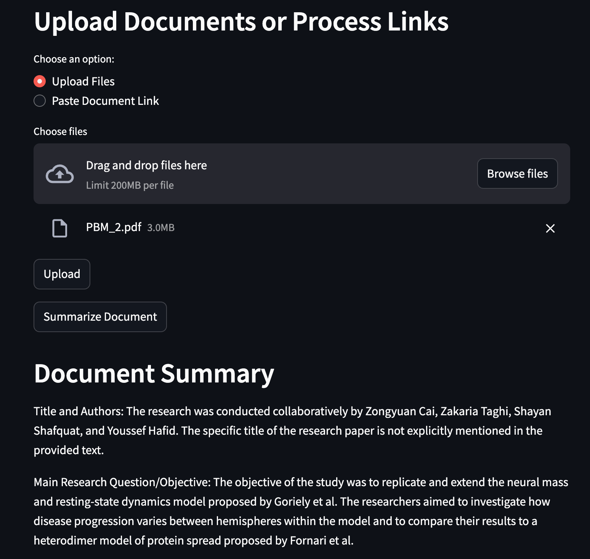
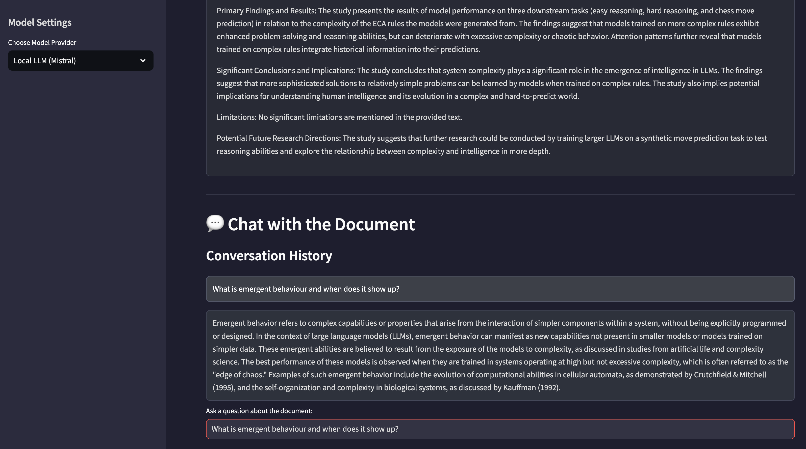

# RAG-Based Document Q&A Application

This application is a Retrieval-Augmented Generation (RAG) based system that allows users to upload documents or provide links to documents (including arXiv papers), and then ask questions about the content of those documents.

## Features

- Upload PDF documents
- Process document links, including arXiv papers
- Summarize uploaded documents
- Ask questions about uploaded documents
- Utilizes OpenAI's GPT model for generating answers

## Tech Stack

- FastAPI: Backend API framework
- Streamlit: Frontend user interface
- Langchain: For document processing and vector storage
- FAISS: Vector database for efficient similarity search
- OpenAI API: For text embeddings and question answering
- Poetry: For dependency management

## Setup

1. Clone the repository:
   ```
   git clone https://github.com/yourusername/rag-based-qa-app.git
   cd rag-based-qa-app
   ```

2. Install dependencies using Poetry:
   ```
   poetry install
   ```

3. Set up environment variables:
   Create a `.env` file in the root directory and add your OpenAI API key:
   ```
   OPENAI_API_KEY=your_api_key_here
   ```

4. Run the FastAPI backend:
   ```
   poetry run uvicorn main:app --reload
   ```

5. In a new terminal, run the Streamlit frontend:
   ```
   poetry run streamlit run app.py
   ```

6. Open your browser and navigate to `http://localhost:8501` to use the application.

## Usage

1. Upload a document or paste a document link (including arXiv links).
2. Wait for the document to be processed.
3. Click on "Summarize Document" to get an overview of the uploaded document.
4. Ask questions about the document in the provided text input.
5. View the AI-generated answers based on the document's content.

## Application Interface

### Document Upload and Summary


### Q&A Interface


## Project Structure

- `main.py`: FastAPI application entry point
- `app.py`: Streamlit frontend
- `routers/document_routes.py`: API routes for document processing and Q&A
- `utils/`:
  - `vector_store.py`: FAISS vector store operations
  - `rag_pipeline.py`: Question answering logic
  - `text_processing.py`: Text extraction and chunking

## Running with Docker

1. Build the Docker image:
   ```
   docker build -t rag-qa-app .
   ```

2. Run the Docker container:
   ```
   docker run -p 8000:8000 -p 8501:8501 --env-file .env rag-qa-app
   ```

3. Access the application:
   - FastAPI backend: `http://localhost:8000`
   - Streamlit frontend: `http://localhost:8501`

## Contributing

Contributions are welcome! Please feel free to submit a Pull Request.

## License

This project is licensed under the MIT License.
