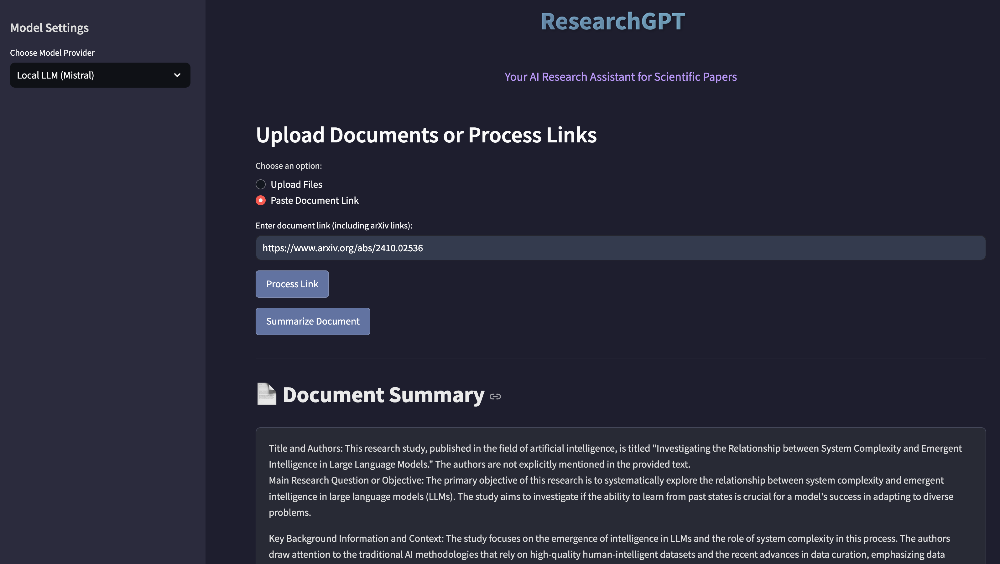

# ResearchGPT: AI Research Assistant

This application is a Retrieval-Augmented Generation (RAG) based system that allows users to upload documents or provide links to documents (including arXiv papers), and then ask questions about the content of those documents. It supports both OpenAI API models and open-source LLMs like Mistral-7B-Instruct, giving users flexibility in choosing their preferred model.

## Features

- Upload PDF documents
- Process document links, including arXiv papers
- Summarize uploaded documents
- Ask questions about uploaded documents
- Flexible Model Selection:
  - OpenAI GPT Models: High-performance option using OpenAI's API
  - Open Source LLMs: Cost-effective alternative using Mistral-7B-Instruct
- Dynamic model switching without losing context
- Cached responses for better performance

## Tech Stack

- FastAPI: Backend API framework
- Streamlit: Frontend user interface
- Langchain: For document processing and vector storage
- FAISS: Vector database for efficient similarity search
- OpenAI API: For text embeddings and question answering
- Hugging Face Hub: For accessing open-source LLMs
- Poetry: For dependency management

## Model Support

### OpenAI Models
- Default model: GPT-3.5-turbo
- Suitable for: Production environments requiring high accuracy
- Requires: OpenAI API key

### Open Source Models
- Default model: Mistral-7B-Instruct-v0.2
- Suitable for: Development, testing, or cost-sensitive deployments
- Requires: Hugging Face API key
- Advantages: No usage costs, full control over the model

## Setup

1. Clone the repository:
   ```bash
   git clone https://github.com/yourusername/rag-based-qa-app.git
   cd rag-based-qa-app
   ```

2. Install dependencies using Poetry:
   ```bash
   poetry install
   ```

3. Set up environment variables:
   Create a `.env` file in the root directory:
   ```
   OPENAI_API_KEY=your_openai_api_key_here  # Required for OpenAI models
   HF_API_KEY=your_huggingface_api_key_here # Required for Mistral and other open-source models
   ```

4. Run the application:
   
   Option 1: Run both services together:
   ```bash
   poetry run start
   ```
   
   Option 2: Run services separately:
   ```bash
   # Terminal 1 - Backend
   poetry run python main.py
   
   # Terminal 2 - Frontend
   poetry run streamlit run app.py
   ```

## Usage

1. Upload a document or paste a document link (including arXiv links).
2. Select your preferred model provider (OpenAI or Local LLM) from the sidebar.
3. Wait for the document to be processed.
4. Click on "Summarize Document" to get an overview of the uploaded document.
5. Ask questions about the document in the provided text input.
6. View the AI-generated answers based on the document's content.

## Model Selection Guide

### When to Use OpenAI Models:
- Need highest accuracy and performance
- Working with complex academic papers
- Require production-grade responses
- Budget allows for API usage

### When to Use Local LLMs (Mistral):
- Development and testing
- Cost-sensitive operations
- Privacy concerns with external APIs
- Need for offline capabilities
- Sufficient for basic summarization and Q&A

## Application Interface

### Document Upload and Summary


### Q&A Interface


## Project Structure

- `main.py`: FastAPI application entry point
- `app.py`: Streamlit frontend
- `routers/document_routes.py`: API routes for document processing and Q&A
- `utils/`:
  - `vector_store.py`: FAISS vector store operations
  - `rag_pipeline.py`: Question answering logic
  - `text_processing.py`: Text extraction and chunking

## Running with Docker

1. Build the Docker image:
   ```
   docker build -t rag-qa-app .
   ```

2. Run the Docker container:
   ```
   docker run -p 8000:8000 -p 8501:8501 --env-file .env rag-qa-app
   ```

3. Access the application:
   - FastAPI backend: `http://localhost:8000`
   - Streamlit frontend: `http://localhost:8501`

## Contributing

Contributions are welcome! Please feel free to submit a Pull Request. Areas of particular interest include:
- Adding support for additional open-source models
- Improving model response caching
- Enhancing the RAG pipeline
- UI/UX improvements

## License

This project is licensed under the MIT License.
